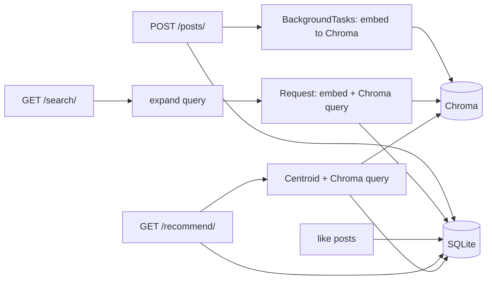

# Semantic Search & Recommendation MVP

[](https://github.com/Lucien0420/semantic-search-recommendation-mvp/actions/workflows/ci.yml)

**Repository:** [github.com/Lucien0420/semantic-search-recommendation-mvp](https://github.com/Lucien0420/semantic-search-recommendation-mvp)

**Traditional Chinese (繁體中文):** [README.zh-TW.md](./README.zh-TW.md)

Backend MVP for **semantic search** and **content-based recommendations** over short text posts: async **FastAPI**, **SQLite** (metadata), **ChromaDB** (persistent vectors), pluggable **embeddings** (Ollama or OpenAI), **JWT** authentication, and optional **query expansion** before embedding.

---

## Overview

End-to-end flow:

1. **Ingest** — Posts are stored in SQLite; vector indexing runs in a **background task** after the HTTP **201** response.
2. **Search** — Query string is optionally **expanded**, embedded, and matched in Chroma (`limit`, `min_score` on cosine similarity).
3. **Recommend** — Uses embeddings of the user's **last 10 liked** posts to build a **centroid** (mean + L2 normalize), queries similar vectors, and excludes posts the user has already **liked** or **viewed**.

Service boundaries (`embedding_service`, `vector_db`, `search_service`, `recommendation_service`, `query_expansion`) are kept separate from HTTP handlers so hybrid retrieval (e.g. BM25 + vectors), reranking, or a different vector store can be introduced without rewriting route handlers.



---

## Core features

| Area | Details |
|------|---------|
| API | FastAPI async; JWT for writes, likes, and recommendations; search is public |
| Indexing | `POST /posts/` persists metadata first, then **BackgroundTasks** for embedding + Chroma upsert |
| Vector store | Chroma under `./chroma_db`; sync client calls run in **`run_in_threadpool`** to avoid blocking the event loop |
| Recommendation | Centroid from up to 10 recent likes; similarity search; excludes liked/viewed posts |
| Search | `GET /search/` with `q`, `limit`, `min_score` |
| Query expansion | `QUERY_EXPANSION_MODE`: `none` \| `dict` (default) \| `ollama` (optional LLM; falls back to dict on failure) |
| Auth | Register, OAuth2 password token endpoint, `/auth/me`; Bearer for protected routes |
| Smoke test | `scripts/smoke_api.ps1` (Windows PowerShell; requires API + Ollama running) |

---

## Tech stack

| Layer | Choice |
|-------|--------|
| Runtime | Python 3.11+ |
| HTTP | FastAPI, Uvicorn, httpx |
| RDBMS | SQLite + SQLAlchemy 2.0 async (`aiosqlite`) |
| Vectors | ChromaDB (local persistence) |
| Embeddings | Ollama (default) or OpenAI |
| Auth | JWT (PyJWT), bcrypt |

### Evolution paths (from this MVP)

Today, **`content` is plain text** and embeddings (and Chroma) are built from that string. The `Post` model already includes **`content_type`** (default `text`) so you can later distinguish text-first items from image/video posts without a breaking schema change.

**Text → images / video**  
Binary blobs usually live in **object storage** (e.g. S3, GCS) or a CDN; the RDBMS holds **URLs, thumbnails, duration, transcoding metadata**. Search/recommendation can stay **text-over-caption / transcript / ASR**, or move to **multimodal embeddings**; either way, the split "relational metadata + vector store for embeddings" tends to survive while you swap preprocessing and embedding models.

**Scaling the data layer**  
SQLite is ideal for local demos. For heavier concurrency, backups, and ops tooling, teams often move to **PostgreSQL** or **MySQL** while keeping the same logical tables (users, posts, interactions).

**Vectors and background work**  
Local **Chroma** is dev-friendly; larger scale may use a **managed vector** service or a distributed index. Heavy ingest (transcode, chunking, long embeddings) pairs naturally with a real **job queue** instead of only FastAPI **BackgroundTasks**.

**Full-text / keyword search**  
If you need tight keyword matching, filters, or analytics dashboards, adding a **full-text engine** (e.g. **Elasticsearch**) alongside vectors is a separate upgrade axis from supporting media content.

---

## Quick start

```bash
python -m venv .venv
.\.venv\Scripts\activate   # Windows
pip install -r requirements.txt
copy .env.example .env
ollama pull nomic-embed-text
python scripts\seed_data.py
uvicorn main:app --reload
```

- **Seed** recreates SQLite tables and the Chroma collection. Demo users: `seed1@example.com` … `seed10@example.com`, password **`Seedpass1`** (aligned with seeded `author_id` values).
- Before any **public** deployment, set a strong random **`JWT_SECRET_KEY`** (see `.env.example`).

### Smoke test (PowerShell)

```powershell
.\scripts\smoke_api.ps1
```

URLs with `&` must be quoted in PowerShell, e.g.:

```powershell
Invoke-RestMethod -Headers @{ Authorization = "Bearer $tok" } "http://127.0.0.1:8000/recommend/?limit=5&min_score=0"
```

---

## API summary

| Method | Path | Auth | Description |
|--------|------|------|----------------|
| POST | `/auth/register` | No | Register |
| POST | `/auth/token` | No | OAuth2 form: `username`=email, `password` |
| GET | `/auth/me` | Bearer | Current user |
| POST | `/posts/` | Bearer | Create post (`author_id` from token) |
| POST | `/posts/{id}/like` | Bearer | Like a post |
| GET | `/search/` | No | Semantic search: `q`, `limit`, `min_score` |
| GET | `/recommend/` | Bearer | Recommendations: `limit`, `min_score` |
| GET | `/health` | No | Health check |

Interactive docs: **`/docs`** (Swagger UI).

**Browser demo (same origin):** after `uvicorn` is running, open **`/demo`** for a single-page UI that calls the API.

### Screenshots & demo recording

Images are **stacked full-width** (not a 3-column table) so GitHub does not shrink wide screenshots to a narrow cell.

#### Backend (e.g. `/docs`)


#### Database (SQLite)


#### Terminal


**Demo video (YouTube):** [Watch on YouTube](https://www.youtube.com/watch?v=REPLACE_WITH_YOUR_VIDEO_ID) — screen recording with subtitles and highlights. (Optional: keep `docs/mvpdemo.mp4` locally; it is gitignored.)

---

## Security & privacy

- **Never commit `.env`** (real secrets). Only `.env.example` belongs in git.
- **`data/`**, **`chroma_db/`**, and log files are gitignored. Treat them as local/runtime state.
- Optional private notes: use **`docs/private/`** (listed in `.gitignore`) for material you do not want published.

---

## Configuration: query expansion

- `QUERY_EXPANSION_MODE=none` — no expansion  
- `dict` (default) — small curated synonym hints  
- `ollama` — uses `OLLAMA_EXPAND_MODEL` with Ollama `/api/generate`; falls back to `dict` if unset or on error  

See `.env.example` for all variables.

---

## Current limitations & roadmap

- **Scale**: single-node SQLite + Chroma; no distributed index or Elasticsearch in this repo.
- **Testing**: PowerShell smoke script for local runs; GitHub Actions runs a lightweight import/compile check (see `.github/workflows/ci.yml`).
- **Jobs**: background work uses FastAPI **BackgroundTasks**; high load would move to a **queue** (retries, DLQ).
- **Frontend**: optional single-file demo at `/demo`; the product surface is still the JSON API.

---

## Operational notes

- Changing embedding model or **vector dimension** requires clearing or recreating the Chroma collection for that name.
- Chroma may log **PostHog telemetry** errors (`capture() ...`); they are **benign** for API behavior. You can try `ANONYMIZED_TELEMETRY=False` to reduce noise.

---

## License

This project is licensed under the [MIT License](./LICENSE).
