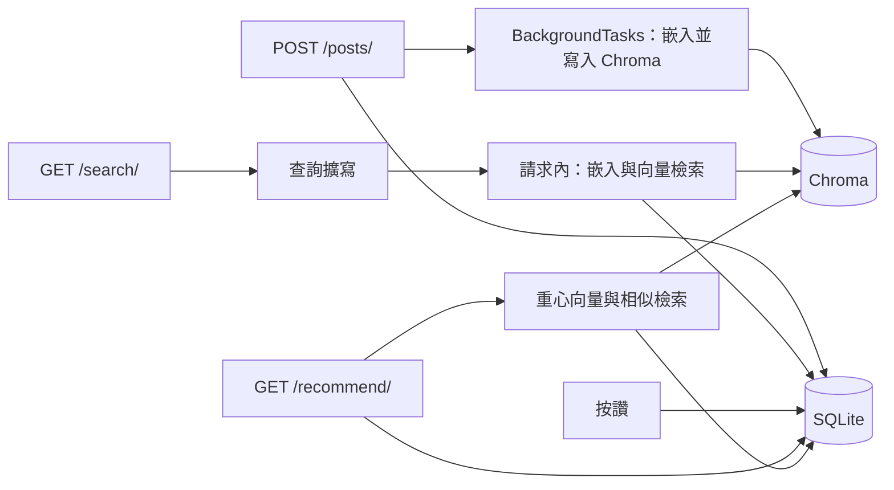
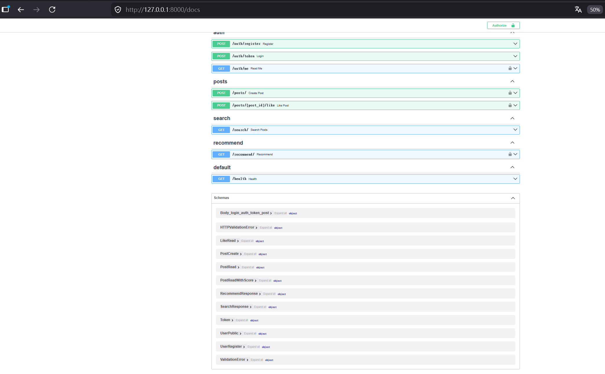
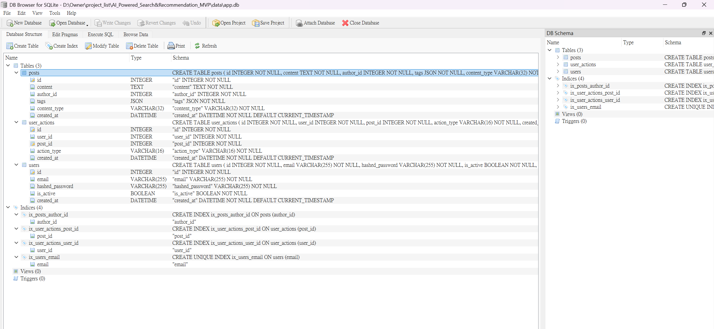
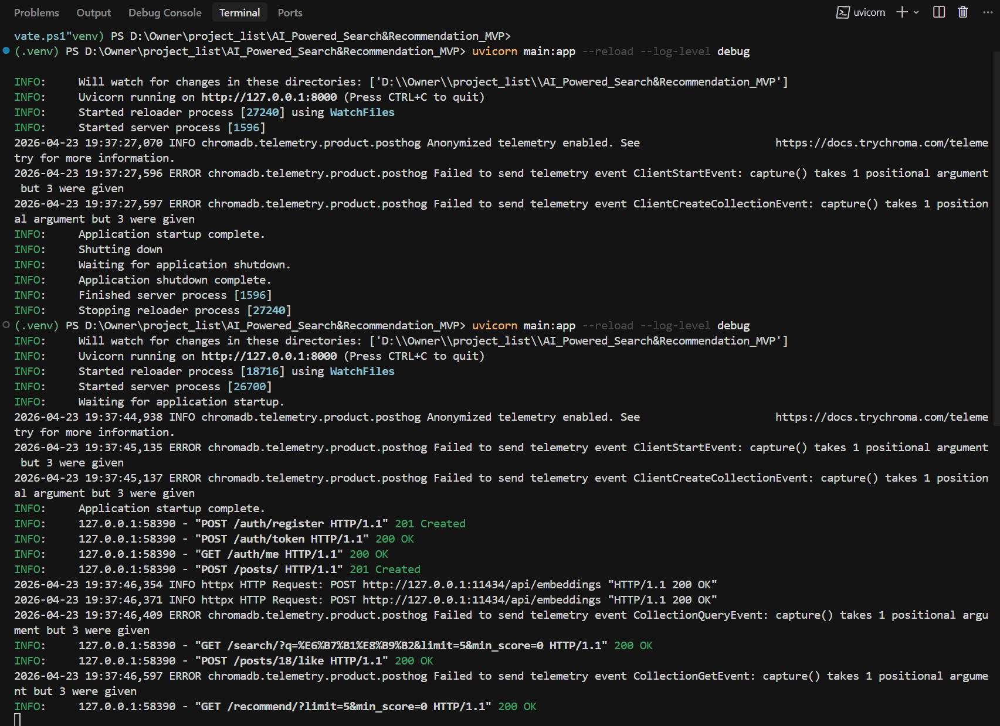

# 語意搜尋與推薦 MVP

[](https://github.com/Lucien0420/semantic-search-recommendation-mvp/actions/workflows/ci.yml)

**程式庫：** [github.com/Lucien0420/semantic-search-recommendation-mvp](https://github.com/Lucien0420/semantic-search-recommendation-mvp)

以**短文貼文**為主的**語意搜尋**與**內容推薦**後端 MVP：全異步 **FastAPI**、**SQLite**（metadata）、**ChromaDB**（持久化向量）、可切換**嵌入**（Ollama 或 OpenAI）、**JWT** 驗證，以及嵌入前可選的**查詢擴寫**。

**English README:** [README.md](./README.md)

**說明：** 本檔為繁體中文說明；執行時 API 回應、日誌與 `/demo` 頁預設為**英文**。

---

## 總覽

端到端流程：

1. **寫入** — 貼文存入 SQLite；在 HTTP **201** 回應之後，於**背景工作**中建立向量索引。  
2. **搜尋** — 查詢字串可選擇性**擴寫**後再嵌入，於 Chroma 中比對（`limit`、`min_score`，餘弦相似度）。  
3. **推薦** — 取使用者**最近 10 筆按讚**貼文的向量，建立**重心向量**（平均後 L2 歸一），做相似檢索，並排除已**按讚**或已**瀏覽**的貼文。

`embedding_service`、`vector_db`、`search_service`、`recommendation_service`、`query_expansion` 與 HTTP 路由分層，便於日後加入混合檢索（例如 BM25 + 向量）、rerank 或更換向量庫，而不必將業務邏輯耦合至 router 層。



---

## 核心功能

| 領域 | 說明 |
|------|------|
| API | FastAPI 異步；發文、按讚、推薦需 JWT；搜尋可匿名 |
| 索引 | `POST /posts/` 先持久化 metadata，再以 **BackgroundTasks** 做嵌入與 Chroma upsert |
| 向量庫 | Chroma 目錄 `./chroma_db`；同步 client 經 **`run_in_threadpool`** 包裝後呼叫，避免阻塞 event loop |
| 推薦 | 最多 10 筆近期按讚向量 → 重心 → 相似檢索；排除已讚／已瀏覽 |
| 搜尋 | `GET /search/`：`q`、`limit`、`min_score` |
| 查詢擴寫 | `QUERY_EXPANSION_MODE`：`none` \| `dict`（預設）\| `ollama`（可選 LLM；失敗則退回 `dict`） |
| 認證 | 註冊、OAuth2 password 換 token、`/auth/me`；受保護路由使用 Bearer |
| Smoke 測試 | `scripts/smoke_api.ps1`（Windows PowerShell；需本機 API 與 Ollama 已啟動） |

---

## 技術棧

| 層級 | 選型 |
|------|------|
| 執行環境 | Python 3.11+ |
| HTTP | FastAPI、Uvicorn、httpx |
| 關聯式資料庫 | SQLite + SQLAlchemy 2.0 異步（`aiosqlite`） |
| 向量 | ChromaDB（本機持久化） |
| 嵌入 | Ollama（預設）或 OpenAI |
| 驗證 | JWT（PyJWT）、bcrypt |

### 擴充與升級方向

目前貼文內容是 **`content` 純文字**，嵌入與 Chroma 也都建立在這段文字上。`Post` 上已有 **`content_type`**（預設 `text`），目的是讓日後能夠區分「仍以文字為主索引」與「圖／影貼文」等不同型態，而不必一開始就把 schema 卡死。

**從純文字延伸到圖片或影片**  
實務上圖檔、影片二進位通常不會塞進 SQLite 的單一文字欄位，而是走**物件儲存**（例如 S3、GCS）或 CDN，資料庫保留 **URL、縮圖、長度、轉檔後 metadata** 等。語意搜尋／推薦有兩條常見路：只對**說明、字幕、語音轉文字**沿用現有的文字嵌入管線；或改用**多模態嵌入**（同一向量空間裡比對圖文）。不論哪一條，「關聯式庫管 metadata、向量庫管 embedding」這個分界大致可以沿用，要換的是**讀檔、前處理、embedding 模型**與 Chroma 裡存的 id／metadata 欄位約定。

**資料層的升級路徑**  
SQLite 適合本機與單人 demo；若要多寫入、權限、備援與營運工具，常見下一步是 **PostgreSQL** 或 **MySQL**。表仍會是使用者、貼文、互動這類概念，遷移多半是連線與 dialect，而不是整份專案重寫。

**向量庫與背景工作**  
本機 **Chroma** 方便開發；流量與資料量上去時，可改為**託管向量服務**或分散式索引。若一則貼文牽涉轉檔、抽幀、長文本分段嵌入，也會和「限制與 roadmap」裡寫的一樣，把 **BackgroundTasks** 收成真正的**工作佇列**，以便做重試與資源管控。

**若需要精準關鍵字比對的全文檢索**  
這是另一個獨立的擴充維度（例如 **Elasticsearch** 與向量結果並用），與「貼文能不能變圖影」是不同的擴充軸；有需要時在搜尋服務邊界加入即可。

---

## 快速開始

```bash
python -m venv .venv
.\.venv\Scripts\activate
pip install -r requirements.txt
copy .env.example .env
ollama pull nomic-embed-text
python scripts\seed_data.py
uvicorn main:app --reload
```

- **Seed** 會重建 SQLite 資料表與 Chroma collection。示範帳號：`seed1@example.com` … `seed10@example.com`，密碼 **`Seedpass1`**（與種子貼文 `author_id` 對齊）。  
- **對外公開 demo 前**，請設定夠強的隨機 **`JWT_SECRET_KEY`**（見 `.env.example`）。

### Smoke 測試（PowerShell）

```powershell
.\scripts\smoke_api.ps1
```

含 `&` 的 URL 在 PowerShell 請用引號包住，例如：

```powershell
Invoke-RestMethod -Headers @{ Authorization = "Bearer $tok" } "http://127.0.0.1:8000/recommend/?limit=5&min_score=0"
```

---

## API 摘要

| Method | Path | 需驗證 | 說明 |
|--------|------|--------|------|
| POST | `/auth/register` | 否 | 註冊 |
| POST | `/auth/token` | 否 | OAuth2 表單：`username`=email、`password` |
| GET | `/auth/me` | Bearer | 目前使用者 |
| POST | `/posts/` | Bearer | 建立貼文（`author_id` 由 token 決定） |
| POST | `/posts/{id}/like` | Bearer | 按讚 |
| GET | `/search/` | 否 | 語意搜尋：`q`、`limit`、`min_score` |
| GET | `/recommend/` | Bearer | 推薦：`limit`、`min_score` |
| GET | `/health` | 否 | 健康檢查 |

互動式文件：**`/docs`**（Swagger UI）。

**瀏覽器示範（同源）：** `uvicorn` 啟動後，可開啟 **`/demo`** 使用單頁介面呼叫 API。

### 截圖與示範錄影

圖片改為**直向、接近全寬**（不用三欄表格），避免 GitHub 把寬螢幕截圖壓進窄欄而變得很小。

#### 後端（例如 `/docs`）



#### 資料庫（SQLite）



#### 終端機



**螢幕錄影（MP4，約 24 MB）：** [`docs/demo.mp4`](./docs/demo.mp4) — 可在 GitHub 檔案預覽開啟，或 clone 後在本機播放。

---

## 安全與隱私

- **請勿將 `.env` 提交至版本庫**（內含真實密鑰）。僅應追蹤 `.env.example`。
- **`data/`**、**`chroma_db/`** 與日誌檔已列入 `.gitignore`，視為本機／執行時狀態即可。
- 若有不想公開的筆記，可使用 **`docs/private/`**（已在 `.gitignore`）。

---

## 設定：查詢擴寫

- `QUERY_EXPANSION_MODE=none` — 不擴寫  
- `dict`（預設）— 小型同義／領域提示  
- `ollama` — 使用 `OLLAMA_EXPAND_MODEL` 呼叫 Ollama `/api/generate`；未設定或失敗時退回 `dict`  

其餘變數見 `.env.example`。

---

## 目前限制與後續方向

- **規模**：單機 SQLite + Chroma；本 repo 未含分散式索引或 Elasticsearch。  
- **測試**：以本機 smoke 腳本為主；GitHub Actions 會跑簡單的匯入／編譯檢查（見 `.github/workflows/ci.yml`）。  
- **背景工作**：現為 FastAPI **BackgroundTasks**；流量高時可改為**佇列**（重試、死信等）。  
- **前端**：可選的單檔示範頁 **`/demo`**；產品介面仍以 JSON API 為主。

---

## 營運注意

- 更換嵌入模型或**向量維度**時，需清空或重建對應名稱的 Chroma collection。  
- Chroma 可能印出 **PostHog 遙測**相關錯誤（`capture() ...`），**不影響** API 行為；可嘗試 `ANONYMIZED_TELEMETRY=False` 降低雜訊。

---

## 授權

本專案採 [MIT License](./LICENSE)（英文條款全文見連結檔案）。

